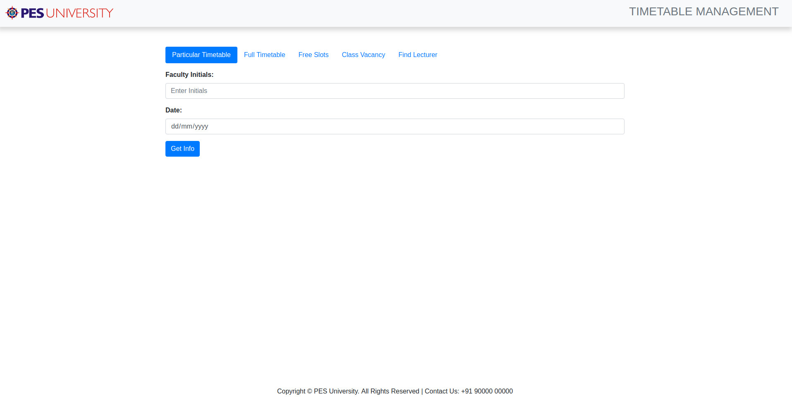
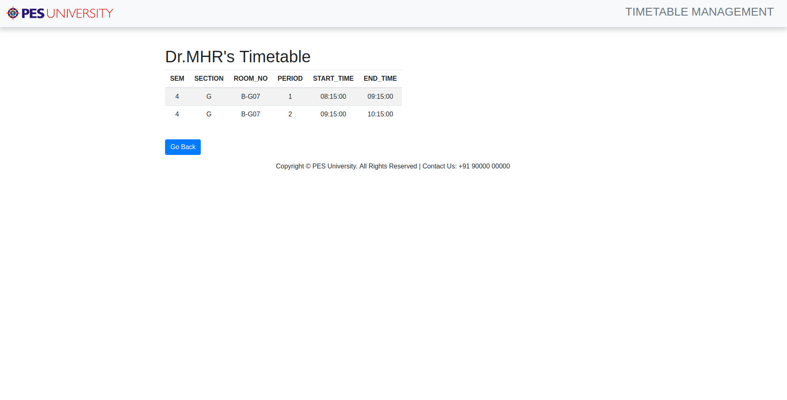
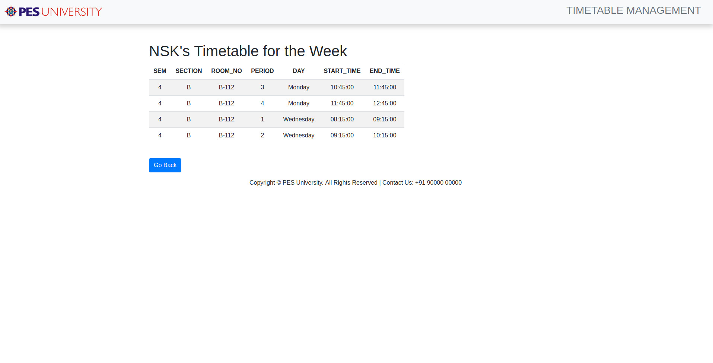
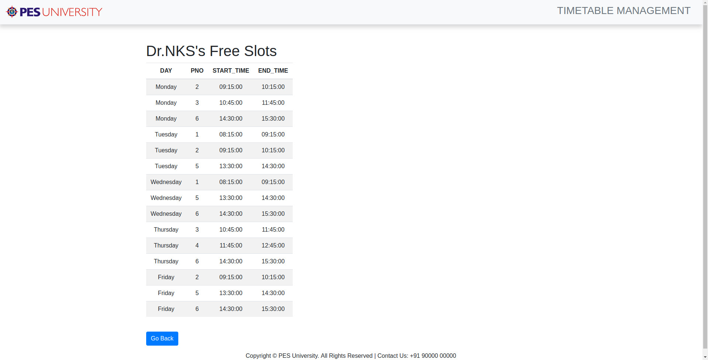

# Timetable Management Application

A simple project which uses a database to store all the various timetables of a college/university and also provides a web interface for students and lecturers to use. A department project carried out under **Dr. Mamatha H. R.**

## Team Details

* Harikrishnan V - PES1201700155
* Prithvi MK - PES1201700142
* Abhaay S - PES1201701554

## User Requirements

* The college has many departments, each of which have
many faculty members that take classes for various
semesters. We keep record of the timings of all classes
taken by faculties of all semesters, in all departments.

* The database will store the timetables of all classes in all
semesters of all departments, from which the
timetables of all teachers and lab instructors can be
extracted.

* Any teacher can view her free slots as well as that of
any other faculty member. This can also be accessed by
students.

* If the timetable of a faculty is changed or they have any
other work, or are absent, the database can be updated
and the timetable of the respective teacher is
reorganized.

* The faculty will have an option to show that they are not
free at any particular time if they wish to do so.

* The database also keeps track of all vacant classes at any
particular time, so that it can be used by any other
teacher if the need arises.

## Entity-Relationship Diagram for The Database

## Relational Schema for The Database

## Web Interface

* Home page of the web inteface
  
  

* Lecturer's timetable for particular date
  
  

* Lecturer's full timetable for the week

  

* Lecturer's free slots for the week

  